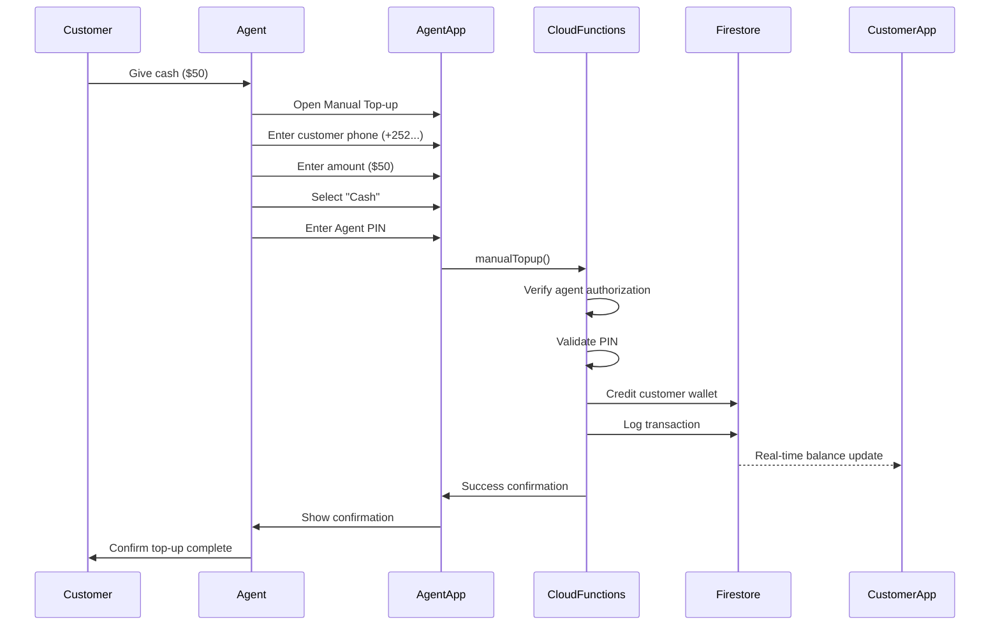

# Manual Top-up System - MVP Guide

## Overview

For MVP launch, QuickPay includes a **manual top-up system** that allows authorized agents (store owners, merchants) to credit user wallets with cash payments. This eliminates the dependency on Zaad/eDahab integration for initial launch.

## How It Works



## Setup Instructions

### 1. Create Top-up Agent Accounts

Agents need special account type to perform top-ups:

```javascript
// In Firebase Console → Firestore
// Update user document for agents:
{
  accountType: "topup_agent",  // or keep "merchant" if also selling
  fullName: "Store Name",
  phoneNumber: "+252XXXXXXXXX",
  // ... other fields
}
```

**Recommended agents:**
- Your own stores/kiosks
- Trusted local shops
- Mobile money agents
- Partner merchants

### 2. Deploy Updated Functions

```bash
cd /Users/mahamedfarah/quickPay/functions
npm install
npm run build
cd ..
firebase deploy --only functions
```

**New functions deployed:**
- `manualTopup` - Process manual top-up
- `getAgentTopupHistory` - View agent's top-up history
- `lookupUserByPhone` - Find user by phone number

### 3. Add Top-up Screen to Merchant App

The screen has been created at:
`merchant-app/src/screens/topup/ManualTopupScreen.tsx`

Add to navigation:

```typescript
// merchant-app/src/navigation/AppNavigator.tsx
import ManualTopupScreen from '../screens/topup/ManualTopupScreen';

// Add to stack:
<Stack.Screen
  name="ManualTopup"
  component={ManualTopupScreen}
  options={{ title: 'Manual Top-up' }}
/>
```

### 4. Add Button to Dashboard

```typescript
// merchant-app/src/screens/dashboard/DashboardScreen.tsx
<TouchableOpacity
  style={styles.actionButton}
  onPress={() => navigation.navigate('ManualTopup')}
>
  <Text style={styles.actionText}>💵 Top Up Customer</Text>
</TouchableOpacity>
```

## Agent Instructions

### How to Top Up a Customer

1. **Receive Cash from Customer**
   - Count the cash carefully
   - Confirm amount with customer

2. **Open Merchant/Agent App**
   - Tap "Top Up Customer" button

3. **Enter Customer Details**
   - Phone number: +252XXXXXXXXX
   - Amount: (match cash received)
   - Payment method: Cash

4. **Optional: Add Reference**
   - Receipt number
   - Notes about transaction

5. **Enter Your Agent PIN**
   - Your 6-digit PIN (not customer's)
   - This authorizes the top-up

6. **Confirm Success**
   - Show confirmation to customer
   - Customer's balance updates immediately

### Security Best Practices

✅ **DO:**
- Verify customer phone number
- Count cash twice before processing
- Keep agent PIN secret
- Process only after receiving payment
- Save receipts for reconciliation

❌ **DON'T:**
- Share your agent PIN
- Process without payment
- Top up unknown numbers
- Process amounts you didn't receive

## Transaction Limits

- **Maximum per transaction**: $1,000
- **No daily limit** (but monitored)
- **Instant processing** (no delays)

## Audit Trail

All manual top-ups are logged in Firestore:

```javascript
// Collection: manualTopups
{
  userId: "customer123",
  agentId: "agent456",
  amount: 5000,  // in cents
  amountDollars: 50,
  currency: "USD",
  paymentMethod: "cash",
  reference: "RCPT-001",
  notes: "Top-up at Main Street store",
  transactionId: "tx123",
  createdAt: timestamp,
  completedAt: timestamp
}
```

## View Top-up History

Agents can view their top-up history:

```typescript
// Call from app
const historyFunction = functions().httpsCallable('getAgentTopupHistory');
const result = await historyFunction({ limit: 50 });

// Returns array of top-ups
result.data.data.forEach(topup => {
  console.log(`${topup.amountDollars} to ${topup.userId}`);
});
```

## Reconciliation

### Daily Reconciliation Process

1. **End of Day Count**
   - Count total cash received
   - Export today's top-up history

2. **Compare Totals**
   - Cash in hand = Total top-ups processed
   - Investigate any discrepancies

3. **Bank Deposit**
   - Deposit cash to business account
   - Keep deposit slip

4. **Record Keeping**
   - Keep transaction logs for 7 years
   - Required for audits

### Monthly Reports

```bash
# Get agent's monthly top-ups
firebase firestore:export gs://your-bucket/exports

# Or query in Firebase Console:
# manualTopups
# where agentId == "your-agent-id"
# where createdAt >= "2026-01-01"
```

## Setting Up Top-up Points

### Recommended Locations

1. **High-Traffic Areas**
   - Main markets
   - Bus terminals
   - Shopping centers

2. **Trusted Partners**
   - Existing shops
   - Phone accessory stores
   - Internet cafes

3. **Your Own Locations**
   - QuickPay branded kiosks
   - Pop-up stands at events

### Agent Onboarding Checklist

- [ ] Background check completed
- [ ] Training on app usage
- [ ] Understanding of security practices
- [ ] Agent account created (accountType: "topup_agent")
- [ ] Test top-up performed
- [ ] Commission structure agreed
- [ ] Daily reconciliation process explained

## Commission Structure

**Suggested commissions:**
- **1-2%** of top-up amount
- Or **flat fee** per transaction ($0.25-0.50)
- Paid weekly/monthly based on performance

**Example:**
- Customer tops up $50
- Agent keeps $1 commission (2%)
- Deposits $49 to QuickPay account

## Customer Experience

**From customer perspective:**
1. Find nearest top-up point
2. Give cash to agent
3. Provide phone number
4. Receive instant balance update
5. Start using QuickPay immediately!

## Advantages Over Automated Top-up

✅ **Immediate Launch**
- No waiting for Zaad/eDahab approval
- Start accepting customers NOW

✅ **Cash Economy**
- Many people prefer cash
- Builds trust through face-to-face

✅ **Customer Support**
- Agents help onboard new users
- Answer questions in person

✅ **Network Effects**
- Each agent is a marketing channel
- Agents promote to their customers

## Transition to Automated Top-up

**Phase 1 (Month 1-3)**: Manual top-up only
- Focus on user acquisition
- Build agent network
- Collect feedback

**Phase 2 (Month 4-6)**: Add automated options
- Integrate Zaad/eDahab
- Manual top-up remains available
- Customers choose preferred method

**Phase 3 (Month 6+)**: Hybrid approach
- Both methods available
- Manual for cash users
- Automated for mobile money users

## Troubleshooting

### "Permission Denied" Error
**Cause**: User account not set as topup_agent
**Fix**: Update accountType in Firestore

### "User Not Found"
**Cause**: Customer hasn't registered yet
**Fix**: Help customer register first, then top up

### "Invalid Agent PIN"
**Cause**: Wrong PIN entered
**Fix**: Re-enter correct PIN (3 attempts)

### Balance Not Updating
**Cause**: Customer app offline
**Fix**: Wait for customer to go online, auto-syncs

## Security Monitoring

**Red flags to watch:**
- Agent processes many failed top-ups
- Large amounts to same phone number repeatedly
- Top-ups at unusual hours
- Agent PIN failures

**Automated alerts** (set up later):
- Daily top-up totals > $1000
- More than 3 failed PIN attempts
- Top-up to blacklisted numbers

## FAQ for Agents

**Q: What if customer gives wrong phone number?**
A: Transaction goes to that number. Cannot reverse. Verify carefully!

**Q: Can I top up myself?**
A: No, system prevents self-top-up. Use another agent.

**Q: What if app crashes during top-up?**
A: Check transaction history. If completed, customer has balance. If not, try again.

**Q: Commission paid when?**
A: Weekly/monthly based on agreement. Track in top-up history.

**Q: Customer wants refund?**
A: Contact QuickPay support. Agents cannot reverse transactions.

## Launch Checklist

- [ ] Manual top-up functions deployed
- [ ] First 5-10 agents trained
- [ ] Top-up screen added to merchant app
- [ ] Agent instructions printed/shared
- [ ] Commission structure finalized
- [ ] Reconciliation process documented
- [ ] Customer education materials ready
- [ ] Signage for top-up points created

## Next Steps

1. **Deploy functions** (see Setup section)
2. **Create agent accounts** (5-10 trusted partners)
3. **Train agents** (1-2 hours per agent)
4. **Soft launch** (one neighborhood first)
5. **Monitor daily** (first week closely)
6. **Scale up** (add more agents weekly)

---

**Remember**: Manual top-up is your MVP secret weapon! Launch fast, validate the market, then add automated options later. Many successful fintech startups started exactly this way! 🚀
